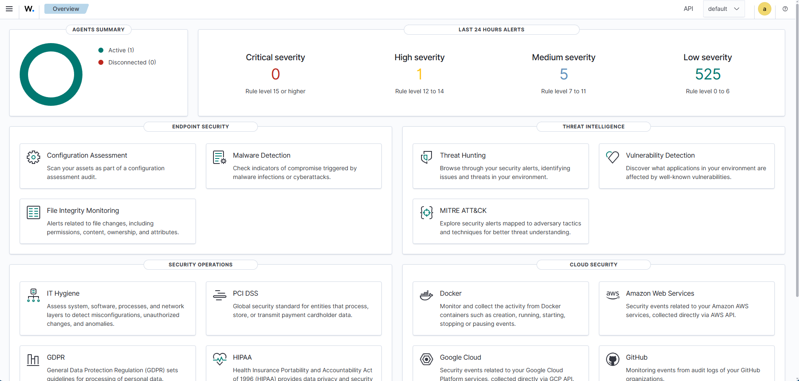
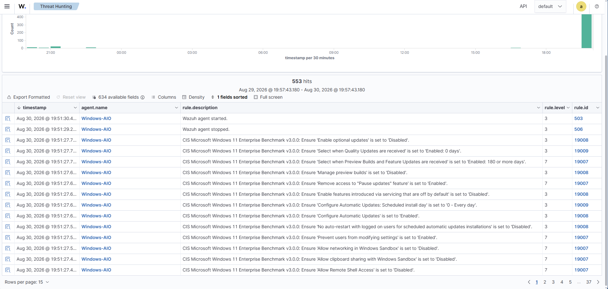

# SOC Security Monitoring & Incident Triage Lab

## Overview

This project documents the development of my hands-on Security Operations Center (SOC) home lab using Wazuh SIEM.

The lab was built to practice the workflow of a Tier 1 SOC analyst, including security monitoring, alert triage, log analysis, event correlation, incident investigation, and documentation.

Rather than focusing only on installing security tools, this project is designed to give me practical experience investigating activity across Windows and Linux systems and determining whether detected behavior is malicious, suspicious, or legitimate.

## Objective

The objective of this lab is to build a functional SOC environment where I can:

- Collect and monitor security telemetry from multiple endpoints.
- Investigate security alerts using supporting log and event data.
- Correlate related events to understand what activity occurred and why.
- Practice distinguishing malicious or suspicious activity from legitimate administrative activity.
- Document investigation findings and determine whether an event requires escalation.
- Develop hands-on experience with the tools and investigative processes used by SOC analysts.

## Lab Environment

The SOC lab consists of a dedicated Wazuh SIEM server and multiple Windows and Linux systems that can be used as monitored endpoints and investigation targets.

### Current Environment

| System | Role | Operating System | Purpose |
|---|---|---|---|
| Wazuh Server | SIEM / Security Monitoring | Linux | Collects, analyzes, and displays security telemetry and alerts |
| Windows-AIO | Monitored Endpoint | Windows 11 | Sends endpoint telemetry to Wazuh for security monitoring and investigation |
| AW-Ubuntu | Linux Endpoint | Ubuntu Linux | Linux system for security monitoring and lab activity |
| Kali Linux | Security Testing System | Kali Linux | Used for controlled security testing within the authorized home lab |

### Virtualization

The Wazuh server runs as a virtual machine using VirtualBox. The environment uses virtual networking and NAT port forwarding to allow physical endpoints on the lab network to communicate with the Wazuh server.

## Network Architecture

The Wazuh SIEM is hosted as a virtual machine on the Legion Go. VirtualBox NAT networking is used for the Wazuh VM, with port forwarding allowing systems on the physical lab network to communicate with Wazuh services inside the virtual network.

### Current Communication Path

Windows-AIO → Legion Go Host → VirtualBox NAT → Wazuh Server

| Service | Protocol/Port | Purpose |
|---|---|---|
| Wazuh Dashboard | HTTPS / TCP 443 | Provides access to the Wazuh web interface |
| Agent Communication | TCP 1514 | Allows enrolled agents to send security data to the Wazuh server |
| Agent Enrollment | TCP 1515 | Used when enrolling new Wazuh agents |

The Windows-AIO endpoint communicates with the Legion Go host, where VirtualBox port-forwarding rules direct Wazuh traffic to the SIEM virtual machine.

## Tools & Technologies

| Tool / Technology | Use in Lab |
|---|---|
| Wazuh | SIEM monitoring, alert generation, log analysis, and security-event investigation |
| VirtualBox | Hosts and manages the virtualized Wazuh server |
| Windows 11 | Monitored endpoint and source of security telemetry |
| Ubuntu Linux | Linux endpoint and lab environment |
| Kali Linux | Controlled security testing within the authorized lab |
| PowerShell | Windows administration, connectivity testing, and agent management |
| tcpdump | Packet capture and network troubleshooting |
| Wireshark | Network traffic and protocol analysis |
| Linux Audit | Provides security-relevant Linux activity used during investigations |

## Wazuh SIEM Deployment

I deployed a Wazuh all-in-one SIEM server as a virtual machine using VirtualBox. The deployment provides centralized security monitoring, alerting, log analysis, and endpoint visibility for the lab environment.

### Initial Configuration

During deployment, I:

- Configured the Wazuh virtual machine using VirtualBox.
- Verified that the Wazuh manager, indexer, and dashboard services were running.
- Verified that the server was listening for Wazuh agent enrollment and communication.
- Configured VirtualBox NAT networking and port forwarding to allow physical lab systems to communicate with the virtualized Wazuh server.
- Verified network connectivity and access to the Wazuh dashboard.
- Accessed the Wazuh dashboard through HTTPS and confirmed that the SIEM was operational.

### Wazuh Dashboard

The Wazuh dashboard provides centralized visibility into connected agents, security alerts, endpoint security monitoring, threat hunting, vulnerability detection, and MITRE ATT&CK-mapped activity.

The dashboard below confirms that the SIEM is operational and receiving telemetry from an enrolled endpoint.

*Figure 1: Wazuh SIEM dashboard showing an active monitored endpoint and generated security alerts.*

## Windows Endpoint Monitoring

I deployed a Wazuh agent to a Windows 11 system named `Windows-AIO` and enrolled the endpoint with the Wazuh server.

After the agent was started, the endpoint began sending security telemetry to the SIEM. Wazuh generated events related to agent activity and Windows security configuration assessments, confirming that the endpoint was successfully communicating with the server and that its telemetry was being analyzed.

*Figure 2: Wazuh Threat Hunting view showing security telemetry collected from the Windows-AIO endpoint.*
