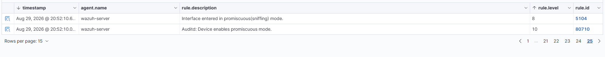
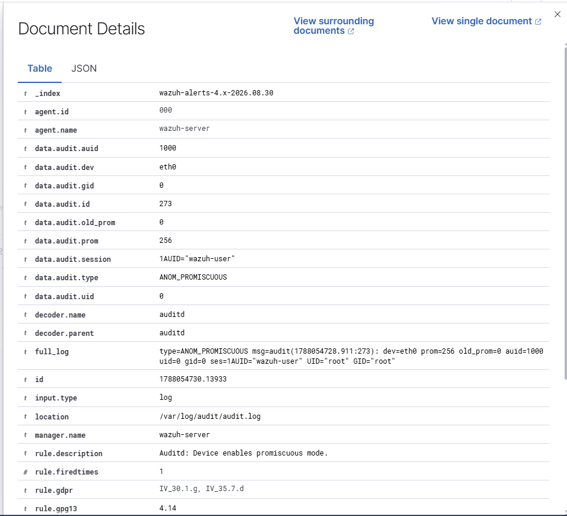
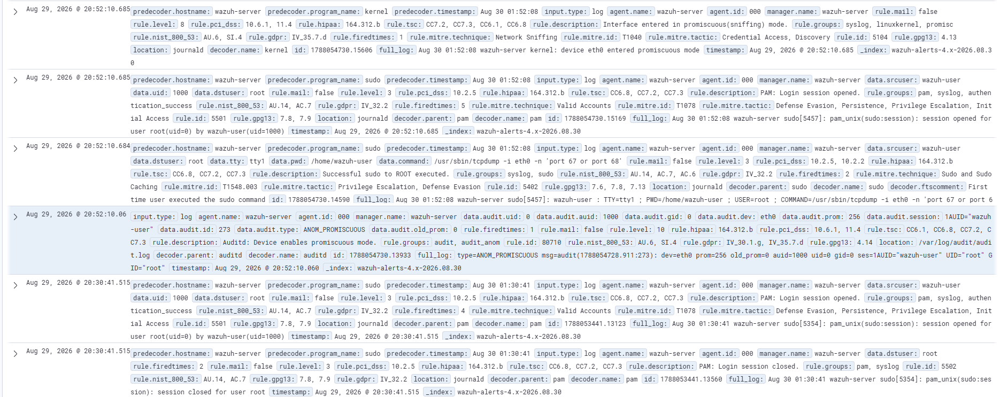
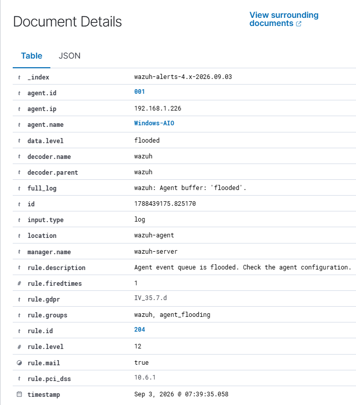
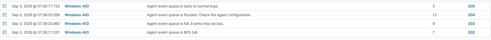
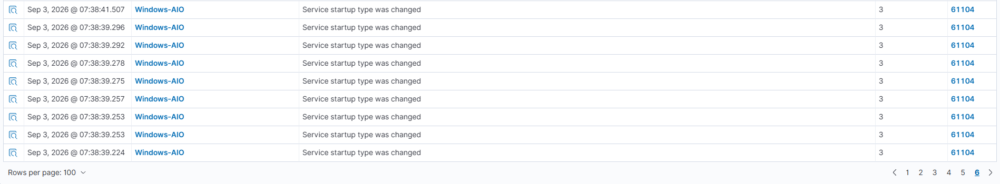
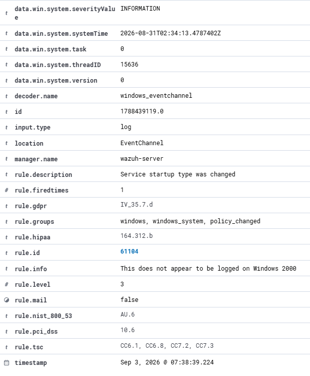
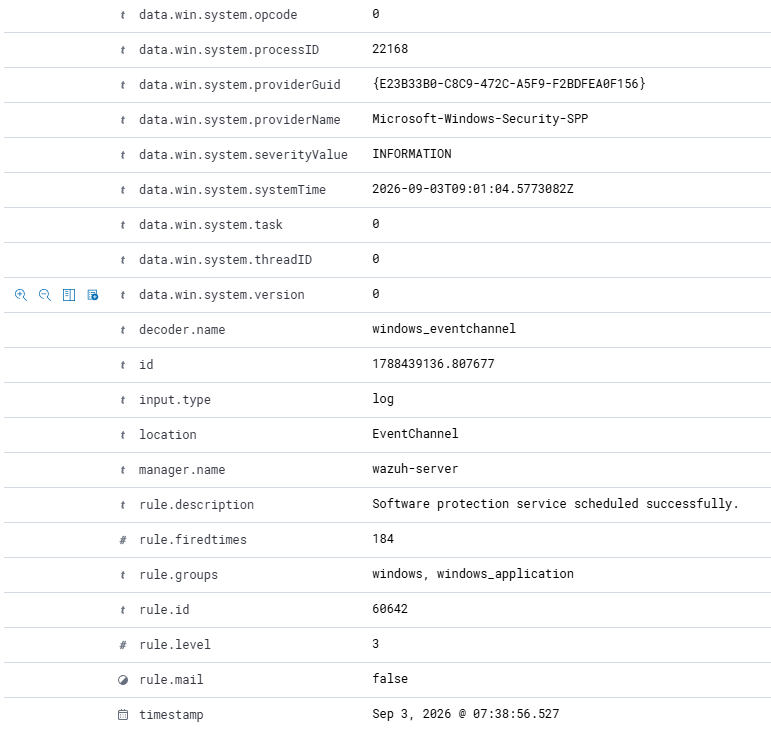

# SOC Security Monitoring & Incident Triage Lab

## Overview

This project documents the development of my hands-on Security Operations Center (SOC) home lab using Wazuh SIEM.

The lab was built to practice the workflow of a Tier 1 SOC analyst, including security monitoring, alert triage, log analysis, event correlation, incident investigation, and documentation.

Rather than focusing only on installing security tools, this project is designed to give me practical experience investigating activity across Windows and Linux systems and determining whether detected behavior is malicious, suspicious, or legitimate.

## Objective

The objective of this lab is to build a functional SOC environment where I can:

- Collect and monitor security telemetry from multiple endpoints.
- Investigate security alerts using supporting log and event data.
- Correlate related events to understand what activity occurred and why.
- Practice distinguishing malicious or suspicious activity from legitimate administrative activity.
- Document investigation findings and determine whether an event requires escalation.
- Develop hands-on experience with the tools and investigative processes used by SOC analysts.

## Lab Environment

The SOC lab consists of a dedicated Wazuh SIEM server and multiple Windows and Linux systems that can be used as monitored endpoints and investigation targets.

### Current Environment

| System | Role | Operating System | Purpose |
|---|---|---|---|
| Wazuh Server | SIEM / Security Monitoring | Linux | Collects, analyzes, and displays security telemetry and alerts |
| Windows-AIO | Monitored Endpoint | Windows 11 | Sends endpoint telemetry to Wazuh for security monitoring and investigation |
| AW-Ubuntu | Linux Endpoint | Ubuntu Linux | Linux system for security monitoring and lab activity |
| Kali Linux | Security Testing System | Kali Linux | Used for controlled security testing within the authorized home lab |

### Virtualization

The Wazuh server runs as a virtual machine using VirtualBox. The environment uses virtual networking and NAT port forwarding to allow physical endpoints on the lab network to communicate with the Wazuh server.

## Network Architecture

The Wazuh SIEM is hosted as a virtual machine on the Legion Go. VirtualBox NAT networking is used for the Wazuh VM, with port forwarding allowing systems on the physical lab network to communicate with Wazuh services inside the virtual network.

### Current Communication Path

Windows-AIO → Legion Go Host → VirtualBox NAT → Wazuh Server

| Service | Protocol/Port | Purpose |
|---|---|---|
| Wazuh Dashboard | HTTPS / TCP 443 | Provides access to the Wazuh web interface |
| Agent Communication | TCP 1514 | Allows enrolled agents to send security data to the Wazuh server |
| Agent Enrollment | TCP 1515 | Used when enrolling new Wazuh agents |

The Windows-AIO endpoint communicates with the Legion Go host, where VirtualBox port-forwarding rules direct Wazuh traffic to the SIEM virtual machine.

## Tools & Technologies

| Tool / Technology | Use in Lab |
|---|---|
| Wazuh | SIEM monitoring, alert generation, log analysis, and security-event investigation |
| VirtualBox | Hosts and manages the virtualized Wazuh server |
| Windows 11 | Monitored endpoint and source of security telemetry |
| Ubuntu Linux | Linux endpoint and lab environment |
| Kali Linux | Controlled security testing within the authorized lab |
| PowerShell | Windows administration, connectivity testing, and agent management |
| tcpdump | Packet capture and network troubleshooting |
| Wireshark | Network traffic and protocol analysis |
| Linux Audit | Provides security-relevant Linux activity used during investigations |

## Wazuh SIEM Deployment

I deployed a Wazuh all-in-one SIEM server as a virtual machine using VirtualBox. The deployment provides centralized security monitoring, alerting, log analysis, and endpoint visibility for the lab environment.

### Initial Configuration

During deployment, I:

- Configured the Wazuh virtual machine using VirtualBox.
- Verified that the Wazuh manager, indexer, and dashboard services were running.
- Verified that the server was listening for Wazuh agent enrollment and communication.
- Configured VirtualBox NAT networking and port forwarding to allow physical lab systems to communicate with the virtualized Wazuh server.
- Verified network connectivity and access to the Wazuh dashboard.
- Accessed the Wazuh dashboard through HTTPS and confirmed that the SIEM was operational.

### Wazuh Dashboard

The Wazuh dashboard provides centralized visibility into connected agents, security alerts, endpoint security monitoring, threat hunting, vulnerability detection, and MITRE ATT&CK-mapped activity.

The dashboard below confirms that the SIEM is operational and receiving telemetry from an enrolled endpoint.

*Figure 1: Wazuh SIEM dashboard showing an active monitored endpoint and generated security alerts.*

## Windows Endpoint Monitoring

I deployed a Wazuh agent to a Windows 11 system named `Windows-AIO` and enrolled the endpoint with the Wazuh server.

After the agent was started, the endpoint began sending security telemetry to the SIEM. Wazuh generated events related to agent activity and Windows security configuration assessments, confirming that the endpoint was successfully communicating with the server and that its telemetry was being analyzed.

*Figure 2: Wazuh Threat Hunting view showing security telemetry collected from the Windows-AIO endpoint.*

### Analyst Conclusion

The successful enrollment of the `Windows-AIO` endpoint confirmed that the Wazuh agent was communicating with the SIEM and that Windows security telemetry was being collected and analyzed.

Reviewing the incoming events also demonstrated how endpoint activity becomes visible to a SOC analyst through centralized monitoring. Agent status, configuration assessment results, rule levels, and rule IDs provide starting points for identifying events that may require further investigation.

## Alert Investigation: Promiscuous Mode Detection

During review of Wazuh security alerts, I identified two related detections indicating that the Wazuh server's `eth0` network interface had entered promiscuous mode.

The alerts included:

- **Rule Level 8:** Interface entered in promiscuous (sniffing) mode.
- **Rule Level 10:** Auditd: Device enables promiscuous mode.

Because promiscuous mode can be associated with network packet capture and traffic sniffing, I investigated the activity to determine whether it represented unauthorized behavior or legitimate administrative activity.

### Initial Evidence

*Figure 3: Wazuh detections showing the network interface entering promiscuous mode.*

### Investigation

I opened the higher-severity Level 10 alert to examine the underlying event details.

The event was generated by Linux Audit (`auditd`) and showed that:

- The affected device was `eth0`.
- The event type was `ANOM_PROMISCUOUS`.
- The interface changed from `old_prom=0` to `prom=256`.
- The activity was associated with the `wazuh-user` login session.
- The effective user recorded in the event was `root`.

*Figure 4: Detailed Auditd event showing the eth0 interface entering promiscuous mode.*

### Event Correlation

To determine what caused the interface to enter promiscuous mode, I reviewed the surrounding events from the same time period.

The surrounding telemetry showed that `wazuh-user` had successfully executed a command with elevated privileges immediately before the promiscuous-mode detection:

`/usr/sbin/tcpdump -i eth0 -n 'port 67 or port 68'`

The command used `tcpdump` to capture DHCP traffic on `eth0`. This activity correlated with the promiscuous-mode alert and provided context for why the interface changed modes.

*Figure 5: Surrounding Wazuh events correlating the promiscuous-mode detection with an authorized tcpdump packet capture.*

### Analysis & Disposition

After correlating the alert with the surrounding events, I determined that the promiscuous-mode activity was caused by an authorized `tcpdump` packet capture that I had previously performed while troubleshooting DHCP communication on the Wazuh server.

The alert itself was valid: the `eth0` interface did enter promiscuous mode. However, the activity was expected and had a legitimate administrative purpose.

| Field | Determination |
|---|---|
| Alert | Device enables promiscuous mode |
| Severity | Wazuh Rule Level 10 |
| Endpoint | Wazuh Server |
| Detection Source | Linux Audit (`auditd`) |
| Affected Interface | `eth0` |
| Related Activity | Authorized `tcpdump` packet capture |
| Determination | Legitimate administrative activity |
| Disposition | **Benign Positive** |
| Escalation | Not required |

### Analyst Conclusion

**Benign Positive — No escalation required.**

The detection correctly identified the network interface entering promiscuous mode. Investigation of the event details and surrounding telemetry showed that the activity correlated with an authorized `tcpdump` command used for DHCP troubleshooting.

This investigation demonstrated why alert severity alone does not determine whether activity is malicious. Context, timestamps, user activity, commands, and surrounding events must be correlated before determining the appropriate disposition.

## Alert Investigation: Agent Event Queue Flood

During review of Wazuh security alerts, I identified a Level 12 alert indicating that the `Windows-AIO` agent event queue had become flooded.

The alert stated:

- **Rule Level 12:** Agent event queue is flooded. Check the agent configuration.
- **Rule ID:** 204
- **Endpoint:** Windows-AIO

Because a flooded event queue may result in security events being delayed or lost, I investigated the activity to determine what caused the queue to become overloaded and whether the condition required escalation.

### Initial Evidence

The initial alert showed that the `Windows-AIO` agent event queue progressed through multiple warning states within a short period:

- **07:39:17** — Agent event queue reached 90% capacity.
- **07:39:20** — Agent event queue became full and events were at risk of being lost.
- **07:39:35** — Agent event queue became flooded.
- **07:40:17** — Agent event queue returned to normal load.

This progression indicated that the queue experienced a temporary increase in event volume before recovering.

*Figure 6. Level 12 Wazuh alert showing the Windows-AIO agent event queue in a flooded state.*

*Figure 7. Queue progression showing the Windows-AIO agent reaching 90% capacity, becoming full, entering a flooded state, and returning to normal load.*

### Investigation

I reviewed the events surrounding the queue flood to determine whether the condition was caused by normal event volume, an agent configuration issue, or another operational condition.

Reviewing telemetry immediately before the queue warnings revealed a large burst of events from `Windows-AIO`. Multiple events were received within fractions of a second, including repeated Windows service-related events.

This indicated that the agent was processing a sudden concentration of telemetry rather than a normal steady flow of events.

*Figure 8. Multiple Windows-AIO events arriving within fractions of a second immediately before the agent queue warnings.*

### Event Correlation

I compared the Wazuh event timestamps with the original Windows event timestamps to determine whether the events in the burst were newly generated.

The comparison showed that some events received by Wazuh on September 3 had originally been generated by Windows significantly earlier. For example, a Windows service event received by Wazuh at approximately `07:38:39` contained an internal Windows timestamp from August 31.

This indicated that the burst included backlogged events rather than only newly generated activity.

*Figure 9. Windows-AIO event details showing the service event associated with the event burst.*

*Figure 10. Windows-AIO event showing an internal Windows timestamp several hours earlier than the time the event was received and displayed by Wazuh, providing additional evidence of delayed event processing.*

Further review of the surrounding timeline showed that the Wazuh server started at approximately `07:38:50`. Shortly afterward, the `Windows-AIO` agent began reporting queue-capacity warnings.

The sequence was:

- **07:38:50** — Wazuh server started.
- **07:39:17** — Windows-AIO agent queue reached 90% capacity.
- **07:39:20** — Agent queue became full.
- **07:39:35** — Agent queue entered a flooded state.
- **07:40:17** — Agent queue returned to normal load.

Combined with the delayed Windows events identified earlier, this timeline indicates that backlogged endpoint telemetry was processed after the Wazuh server became available, temporarily overwhelming the Windows-AIO agent event queue.

*Figure 11. Timeline showing the Wazuh server starting immediately before the Windows-AIO agent queue progressed from 90% capacity to flooded and then recovered to normal load.*

### Analysis & Disposition

The Level 12 alert correctly identified that the `Windows-AIO` agent event queue had entered a flooded state. Investigation showed that the condition was temporary and correlated with the Wazuh server becoming available and processing a burst of backlogged Windows telemetry.

The queue progressed from 90% capacity to full and then flooded, creating a temporary risk that security events could be delayed or lost. However, the queue returned to normal load approximately 42 seconds after entering the flooded state without manual intervention.

The surrounding telemetry did not indicate malicious activity associated with the queue flood. Based on the available evidence, the alert represented a legitimate operational condition rather than a security incident.

| Field | Finding |
|---|---|
| Alert | Agent event queue is flooded |
| Severity | Level 12 |
| Rule ID | 204 |
| Endpoint | Windows-AIO |
| Detection Source | Wazuh Agent |
| Related Activity | Processing of backlogged Windows telemetry |
| Determination | Legitimate operational condition |
| Disposition | **Benign Positive** |
| Escalation | Not required |

### Analyst Conclusion

**Benign Positive — No escalation required.**

The Level 12 queue-flood detection represented a real condition on the `Windows-AIO` endpoint, but investigation found no evidence that the activity was malicious.

Event correlation showed that the Wazuh server became available shortly before a burst of backlogged Windows telemetry was processed. This caused the agent event queue to rapidly progress from 90% capacity to full and then flooded before automatically returning to normal load.

This investigation demonstrated the importance of correlating alert timing with surrounding endpoint and server activity. A high-severity alert may identify a legitimate operational problem rather than a security incident, and determining the appropriate disposition requires investigating the context surrounding the detection.
